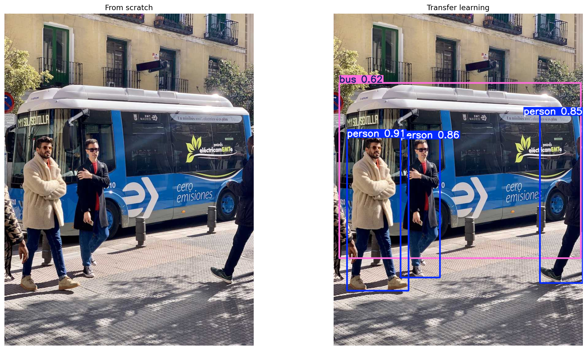

# YOLOv8 Training Strategy Comparison: From Scratch vs. Transfer Learning
 
A controlled experiment comparing two parameter initialization strategies for
object detection on a limited-data regime. Both models share identicals
architecture (YOLOv8n), dataset (COCO128), hyperparameters, and evaluation
protocol. The only variable is the weight initialization.

## Key Results

| Strategy | mAP@0.5 | mAP@0.5:0.95 | Converged? |
|---|---|---|---|
| From scratch (`yolov8n.yaml`) | **0.004** | **0.001** | No |
| Transfer learning (`yolov8n.pt`) | **0.843** | **0.671** | Yes |

Training hardware: Tesla T4, 50 epochs, batch 16, 640x640, seed 0.
Full metrics from the latest Modal run are in [results/metrics.md](results/metrics.md).

### Comprehensive Inference Testing



**Multiple diverse test images** — The experiment includes comprehensive
inference testing on 3+ diverse images (street scenes, sports, etc.). See
[results/metrics.md](results/metrics.md) for full visual results and
detailed detection annotations for each image and model.

---

## Experiment Design

### The question
│   └── modal_train.py            # Cloud training script w/ multi-image testing
Does parameter initialization matter when the training set is small?

### Setup
│   │   └── inference/            # Per-image comparison photos

Both models run the **same training loop** — same optimizer (AdamW, lr 1.19e-4),
same augmentation pipeline, same batch size and image resolution. The only
difference:

```
From scratch:     YOLO('yolov8n.yaml')   # random init: θ ~ N(0,1)
Transfer learning: YOLO('yolov8n.pt')    # COCO pretrained: θ = θ_pretrained
```

### Why COCO128

128 images represent a realistic constraint in applied computer vision: a
dataset assembled over a few hours of annotation. It is large enough to be
non-trivial but small enough to expose the initialization gap clearly.

---

## Repository Structure

```
.
├── notebooks/
│   └── yolo_comparison.ipynb     # Interactive walkthrough (Google Colab)
├── src/
│   └── modal_train.py            # Cloud training script (modal.com)
├── results/
│   ├── metrics.md                # Quantitative results
│   ├── figures/                  # Inference comparison images
│   └── training_curves/          # Loss and mAP plots per run
├── configs/
│   └── coco128.yaml              # Dataset config reference
├── requirements.txt
└── .gitignore
```

---

## Reproducing the Results

### Option A — Google Colab (interactive)

1. Open `notebooks/yolo_comparison.ipynb` in Colab.
2. Set the runtime to GPU: **Runtime > Change runtime type > T4 GPU**.
3. Run all cells (`Runtime > Run all`).

The notebook trains both models sequentially, validates each, and produces
side-by-side inference figures saved to `/content/yolo_compare/`.

### Option B — Modal (parallel cloud GPUs)

```bash
pip install modal
modal token new          # one-time browser auth
modal run src/modal_train.py
```

This spawns two T4 containers simultaneously — one per training strategy —
and writes the annotated outputs to `results/figures/` and the metric summary to
`results/metrics.md` on your local machine. Automatically tests on multiple diverse images.

Override any hyperparameter:

```bash
modal run src/modal_train.py \
    --epochs 100 \
    --imgsz 640 \
    --batch 32 \
    --data my_dataset.yaml \
    --test-image ./test.jpg
```

To use a larger GPU (e.g. A10G), change the `GPU` constant in `src/modal_train.py`.

### Custom dataset

Replace `coco128.yaml` with any YOLO-format dataset config. Required layout:

```
datasets/<name>/
    images/{train,val}/*.jpg
    labels/{train,val}/*.txt    # one label per line: class cx cy w h
```

---

## Observations and Analysis

### Bounding-box localization

The from-scratch model remained extremely weak after 50 epochs, finishing with
mAP@0.5 = 0.004 and mAP@0.5:0.95 = 0.001. The transfer-learning model
converged much faster and finished at mAP@0.5 = 0.843 and mAP@0.5:0.95 =
0.671.

### Why the gap is this large

YOLOv8n has 3.16 M parameters organized across a CSPDarknet backbone and a
PANet neck. On 128 training images covering 80 object categories, the
gradient signal per parameter per epoch is approximately:

```
128 images / 3,157,184 params ~ 4e-5  gradient samples per weight
```

This is insufficient for the network to reliably distinguish classes from
background noise. The pretrained model bypasses this entirely: early layers
already encode Gabor-like edge detectors and mid-level shape descriptors.
Fine-tuning only has to specialize the detection head.

### Learning curve (transfer learning)

The transfer-learning model produced 4 detections on the held-out test image
in the latest run, while the from-scratch model produced none. This is
consistent with the same conclusion: pretraining gives the detector a useful
starting point that the tiny COCO128 regime cannot recover from scratch.

---

## Technical Stack

| Component | Version |
|---|---|
| Object detector | YOLOv8n (Ultralytics 8.3.253) |
| Framework | PyTorch 2.11.0+cu130 |
| GPU | NVIDIA Tesla T4, 14 913 MiB |
| CUDA | 13.0 |
| Python | 3.11.12 |
| Cloud runtime | Modal (Debian Slim, parallel containers) |

---

## References

- Redmon, J. et al. "You Only Look Once: Unified, Real-Time Object Detection."
  CVPR 2016.
- Wang, C.-Y. et al. "YOLOv7: Trainable bag-of-freebies sets new
  state-of-the-art for real-time object detectors." CVPR 2023.
- Jocher, G. et al. Ultralytics YOLOv8. https://github.com/ultralytics/ultralytics
- Lin, T.-Y. et al. "Microsoft COCO: Common Objects in Context." ECCV 2014.
- Yosinski, J. et al. "How transferable are features in deep neural networks?"
  NeurIPS 2014.
