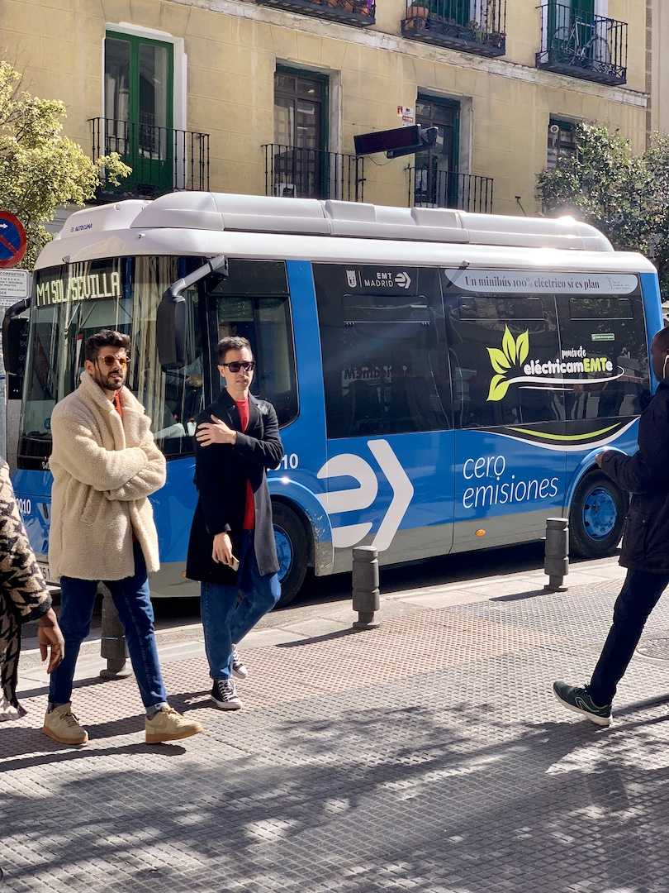
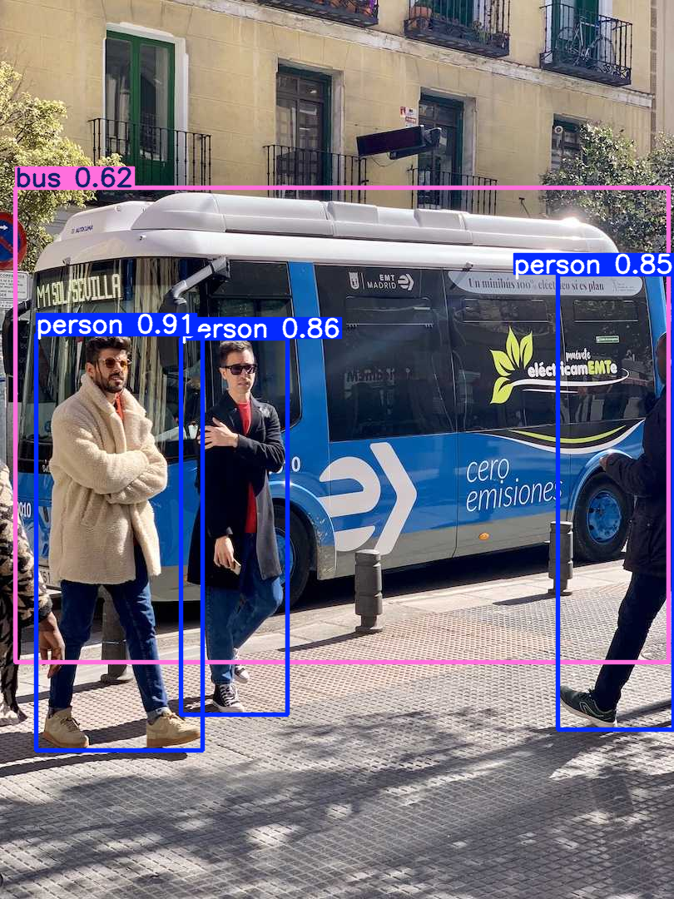
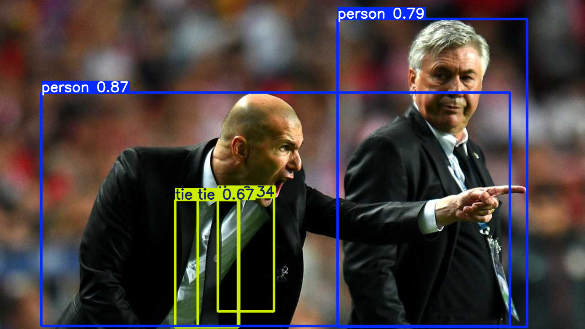

# Experimental Results

All runs: YOLOv8n, coco128.yaml, 50 epochs, 640x640, batch 16, Tesla T4 (14 913 MiB), seed 0.

## Validation Metrics (on train/val split)

| Model | mAP@0.5 | mAP@0.5:0.95 | Precision | Recall |
|---|---|---|---|---|
| From scratch | 0.004 | 0.001 | 0.007 | 0.002 |
| Transfer learning | 0.843 | 0.671 | 0.852 | 0.767 |

## Inference Results on Test Images

### Summary: Detection Count per Image

| Image | From Scratch | Transfer Learning |
|---|---|---|
| Bus | 0 | 4 |
| Zidane | 0 | 5 |

### Detailed Inference Results

#### Bus

**From Scratch Model:** 0 detections
(No detections)

**Transfer Learning Model:** 4 detections
```
  person          conf=0.906  bbox=[43.9, 401.9, 243.2, 901.4]
  person          conf=0.863  bbox=[217.6, 406.9, 345.6, 858.6]
  person          conf=0.848  bbox=[670.7, 329.7, 809.7, 876.6]
  bus             conf=0.615  bbox=[18.4, 225.3, 803.7, 795.1]
```




#### Zidane

**From Scratch Model:** 0 detections
(No detections)

**Transfer Learning Model:** 5 detections
```
  person          conf=0.868  bbox=[90.6, 202.8, 1115.2, 713.1]
  person          conf=0.786  bbox=[738.9, 41.9, 1153.2, 715.5]
  tie             conf=0.667  bbox=[432.1, 437.2, 523.8, 714.4]
  tie             conf=0.344  bbox=[477.0, 431.0, 599.6, 681.2]
  tie             conf=0.316  bbox=[383.3, 437.7, 520.5, 716.3]
```




